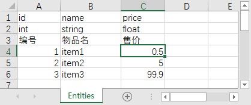
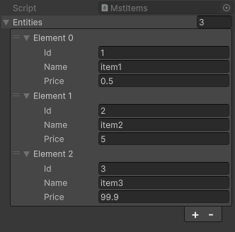
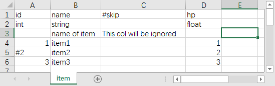
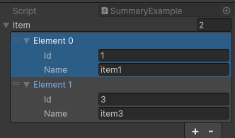
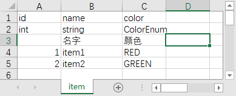
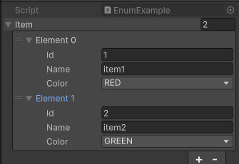
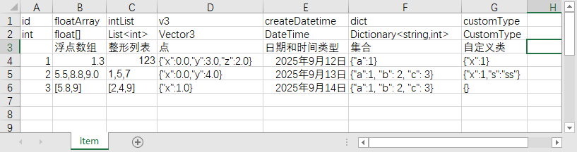
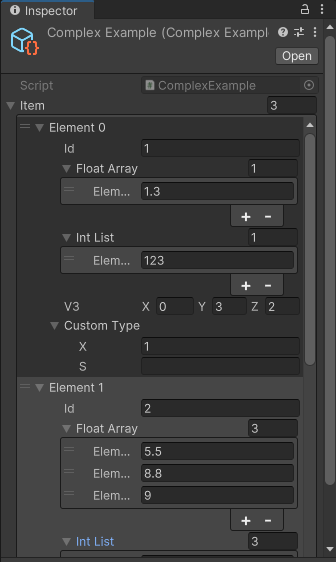

# UnityExcelImporterX - Unity Excel数据导入工具

自动将Excel文件（.xls, .xlsx）中的数据转换为Unity的ScriptableObject资源。

项目基于[unity-excel-importer](https://github.com/mikito/unity-excel-importer.git)，增加了一些新特性。

## ✨ 核心特性

- 🤖 **零代码生成**：无需手动编写实体类脚本，自动生成完整代码
- 🔄 **实时同步**：Excel修改后自动更新Unity资源
- 📝 **智能注释**：支持注释行/列，设置数据边界
- 🎯 **类型丰富**：支持基本类型、枚举、数组、字典、日期时间和自定义类型
- 📊 **多表支持**：一次性导入Excel中的所有工作表

## 📦 安装方法

<details>
<summary>💡 通过 .unitypackage 文件安装（推荐）</summary>

1. 访问 [GitHub Releases页面](https://github.com/nayaku/UnityExcelImporterX/releases)
2. 下载最新的 `.unitypackage` 文件
3. 双击文件或在Unity中通过 **Assets → Import Package → Custom Package** 导入
</details>

<details>
<summary>💡 通过 OpenUPM 安装</summary>

该包已发布至 <a href="https://openupm.com/packages/net.nayaku.unity-excel-importer-x/">OpenUPM</a> 仓库。
安装前请确保您的项目已安装`NPOI`和`Newtonsoft.Json`依赖包。

```
openupm add net.nayaku.unity-excel-importer-x
```

</details>

## 🚀 快速开始

### 步骤1：创建Excel文件

创建一个Excel文件，按以下格式组织数据：

| 行号 | 内容说明 | 示例 |
|---|---|---|
| **第1行** | 列名（字段名） | `id`, `name`, `price` |
| **第2行** | C#数据类型 | `int`, `string`, `float` |
| **第3行** | 注释说明 | `编号`, `物品名`, `售价` |
| **第4行+** | 实际数据 | `1`, `物品名1`, `99.5` |

📋 **示例表格结构：**


🎯 **将Excel文件放入Unity项目的任意文件夹中**

### 步骤2：自动生成代码

1. **在Unity中选中Excel文件**
2. **右键 → Create → ExcelAssetScript**（或在顶部菜单选择 **Assets → Create → ExcelAssetScript**）
3. **系统将自动个实体类脚本**（如 `MstItems.cs`）


📊 **生成的代码示例：**

```c#
// 实体类 - 对应表格的每一行数据
[Serializable]
public class MstItemsEntity
{
    /// <summary>
    /// 编号
    /// </summary>
    public int id;           // 自动匹配Excel第1列
    /// <summary>
    /// 物品名
    /// </summary>
    public string name;      // 自动匹配Excel第2列 
    /// <summary>
    /// 售价
    /// </summary>
    public float price;      // 自动匹配Excel第3列
}

// 容器类 - 存储所有表格数据
[ExcelAsset]
public class MstItems : ScriptableObject
{
    public List<MstItemsEntity> Entities;  // 所有行数据
}
```

⚠️ **重要提醒**：当Excel表格结构发生变化时（如添加/删除列），需要重新执行此步骤生成最新代码。

### 步骤3：自动导入数据

💡 **只需简单操作**：
- **保存Excel文件**（Ctrl+S）
- **回到Unity**，系统将自动检测变更并导入数据
- **在相同目录下**会生成与Excel同名的 `.asset` 文件

 **如果没有自动生成，可以手动重新导入Excel文件来触发自动生成：**


✅ **完成！** 现在您可以在Unity中直接查看和编辑导入的数据：




## 🎯 高级功能详解

### 注释功能

#### 单行注释
在行的第一个单元格输入 `#`，整行将被忽略。

#### 单列注释  
在列的第一行输入 `#`，整列将被忽略。

**Excel表格：**


**生成的代码和数据：**

```c#
[Serializable]
public class SummaryExampleEntity
{
    public int id; // 只导入A、B列，C列被忽略
    /// <summary>
    /// name of item
    /// </summary>
    public string name;
}


[ExcelAsset]
public class SummaryExample : ScriptableObject
{
    public List<SummaryExampleEntity> item;
}
```



### 数据边界

- **列边界**：第一行出现空单元格时，右侧所有列将被忽略
- **行边界**：第一列出现空单元格时，下方所有行将被忽略

### 枚举类型

#### 步骤1：创建枚举定义
```c#
// 创建 ColorEnum.cs 文件
public enum ColorEnum
{
    RED,    // 红色
    GREEN,  // 绿色  
    BLUE    // 蓝色
}
```

#### 步骤2：Excel中填写枚举值


#### 步骤3：生成的代码和数据
```c#
[Serializable]
public class EnumExampleEntity
{
    public int id;
    /// <summary>
    /// 名字
    /// </summary>
    public string name;
    /// <summary>
    /// 颜色
    /// </summary>
    public ColorEnum color; // 自动匹配枚举类型
}
```



### 复杂类型

**支持数组类型、日期时间类型、字典类型和自定义类型**

使用数组类型的时候，可省略方括号。

**生成的代码和数据：**

创建自定义类型`CustomType`

```c#
[Serializable]
public class CustomType
{
    public int x;
    public string s;
}
```





### 自定义资源路径

通过 `AssetPath` 参数控制生成的 `.asset` 文件位置：

```c#
[ExcelAsset(AssetPath = "Assets/Resources/MasterData")]
public class MstItems : ScriptableObject
{
    public List<MstItemsEntity> Entities;
}
```

### 调试日志

开启导入日志：

```c#
[ExcelAsset(LogOnImport = true)]  // 导入时输出详细日志
public class MstItems : ScriptableObject
{
    public List<MstItemsEntity> Entities;
}
```

### 自定义文件关联

当Excel文件名与ScriptableObject类名不一致时使用：

```c#
// Excel文件名为 "ItemData.xlsx"
// ScriptableObject类名为 "MstItems"

[ExcelAsset(ExcelName = "ItemData")]  // 指定关联的Excel文件名
public class MstItems : ScriptableObject
{
    public List<MstItemsEntity> Entities;
}
```
## 🔧 常见问题

<details>
<summary>Q: Excel修改后没有自动更新？</summary>
**解决方法**：

1. 确保Excel文件已保存
2. 在Unity中右键点击Excel文件 → Reimport
3. 检查控制台是否有错误信息
</details>

## 📄 许可证

本库采用 [MIT许可证](LICENSE.txt)。

---

**如果本工具对您有帮助，请给个⭐Star支持一下！**