# UnityExcelImporterX - Unity Excel数据导入工具

自动将Excel文件（.xls, .xlsx）中的数据转换为Unity的ScriptableObject资源。

项目基于[unity-excel-importer](https://github.com/mikito/unity-excel-importer.git)，增加了一些新特性。

## 核心特性

- **零代码生成**：无需手动编写实体类脚本，自动生成完整代码
- **实时同步**：Excel修改后自动更新Unity资源
- **智能注释**：支持注释行/列，设置数据边界
- **类型丰富**：支持基本类型、枚举、数组、字典、日期时间和自定义类型
- **多表支持**：一次性导入Excel中的所有工作表
- **功能简单**：无需配置，直接导入即可

## 需求

- **Unity版本**：2021.3.45f1 或以上
- **Excel文件格式**：.xls, .xlsx

## 安装方法

<details>
<summary>💡 通过 .unitypackage 文件安装（推荐）</summary>

1. 访问 [GitHub Releases页面](https://github.com/nayaku/UnityExcelImporterX/releases)
2. 下载最新的 `.unitypackage` 文件
3. 双击文件或在Unity中通过 **Assets → Import Package → Custom Package** 导入

</details>

<details>
<summary>💡 通过 OpenUPM 安装</summary>

该包已发布至 <a href="https://openupm.com/packages/net.nayaku.unity-excel-importer-x/">OpenUPM</a> 仓库。
安装前请确保您的项目已安装 `NPOI` 和 `Newtonsoft.Json` 依赖包。

```
openupm add net.nayaku.unity-excel-importer-x
```

</details>

<details>
<summary>💡 通过 Package Manager 以 GIT 依赖方式安装</summary>

请确保您的项目已安装 `NPOI` 和 `Newtonsoft.Json` 依赖包。

1. 打开 Package Manager 窗口（菜单：Window | Package Manager）
2. 点击窗口左上角的 `+` 按钮，选择 "Add package from git URL..."
3. 输入以下 URL 并点击 `Add` 按钮

```
https://github.com/nayaku/UnityExcelImporterX.git?path=Assets/UnityExcelImporterX
```

</details>

## 快速开始

### 步骤1：创建Excel文件

创建一个Excel文件，按以下格式组织数据：

| 行号             | 内容说明       | 示例                           |
| ---------------- | -------------- | ------------------------------ |
| **第1行**  | 字段名 | `id`, `name`, `price`    |
| **第2行**  | C#数据类型     | `int`, `string`, `float` |
| **第3行**  | 注释       | `编号`, `物品名`, `售价` |
| **第4行+** | 实际数据       | `1`, `物品名1`, `99.5`   |

**示例表格结构：**
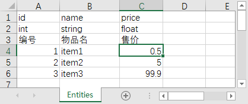

将 Excel 文件放入 Unity 项目的 `Assets` 目录或其子目录中。

### 步骤2：自动生成代码

1. 在Unity中选中Excel文件
2. **右键 → Create → ExcelAssetScript**（或在顶部菜单选择 **Assets → Create → ExcelAssetScript**）
3. 系统将自动生成实体类和容器类脚本（如 `MstItems.cs`）

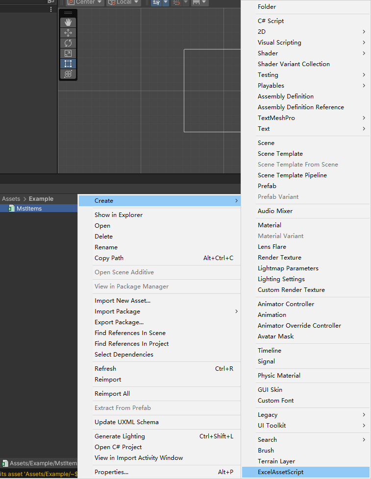

**生成的代码示例：**

```c#
// 实体类 - 对应表格的每一行数据
[Serializable]
public class MstItemsEntity
{
    /// <summary>
    /// 编号
    /// </summary>
    public int id;           // 自动匹配Excel第1列
    /// <summary>
    /// 物品名
    /// </summary>
    public string name;      // 自动匹配Excel第2列 
    /// <summary>
    /// 售价
    /// </summary>
    public float price;      // 自动匹配Excel第3列
}

// 容器类 - 存储所有表格数据
[ExcelAsset]
public class MstItems : ScriptableObject
{
    public List<MstItemsEntity> Entities;  // 所有行数据
}
```

> [!WARNING]
> **重要提醒**：当Excel表格结构发生变化时（如添加/删除列），需要重新执行此步骤生成最新代码。

### 步骤3：自动导入数据

- **保存Excel文件**（Ctrl+S）
- **回到Unity**，系统将自动检测变更并导入数据
- **在相同目录下**会生成与Excel同名的 `.asset` 文件

 如果没有自动生成，可以手动重新导入 Excel 文件来触发自动生成：右键点击 Excel 文件 → **Reimport**。
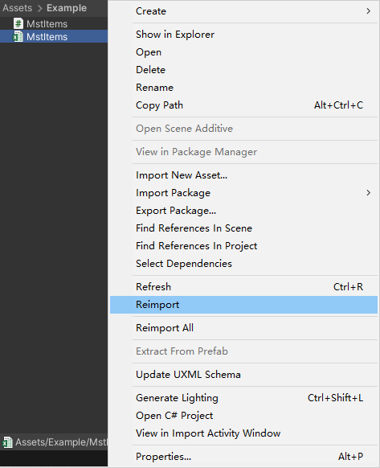

### 完成

现在可以在 Unity Inspector 中直接查看和编辑导入的数据：

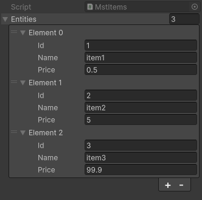

## 高级功能

### 索引功能

在字段名后面追加`, key`可标记为主键，例如`id, key`。支持多个主键。

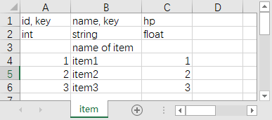

生成的代码会包含一个 `Dictionary`，用于按主键快速查找数据：

```c#
[Serializable]
public class KeyExampleEntity
{
    public int id;
    /// <summary>
    /// name of item
    /// </summary>
    public string name;
    public float hp;
}

[ExcelAsset]
public class KeyExample : ScriptableObject, ISerializationCallbackReceiver
{
    public List<KeyExampleEntity> item = new();
    public Dictionary<(int id, string name), KeyExampleEntity> itemDict;

    public void OnBeforeSerialize()
    {
        // Implement any logic needed before serialization
    }

    public void OnAfterDeserialize()
    {
        // Implement any logic needed after deserialization
        itemDict = new();
        foreach (KeyExampleEntity item in item)
        {
            var key = (
                item.id,
                item.name
            );
            if (itemDict.ContainsKey(key))
            {
                Debug.LogError($"Duplicate key found in itemDict (script: KeyExample): {key}. Each key must be unique.");
                continue; // Skip adding this item to the dictionary
            }
            itemDict[key] = item;
        }
    }
}
```

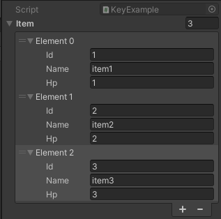

> 如果出现重复主键，会输出错误日志并跳过该条数据。

### 注释功能

#### 行注释

在行的第一个单元格输入 `#`，整行将被忽略。

#### 列注释

在列的第一行输入 `#`，整列将被忽略。

**Excel表格：**
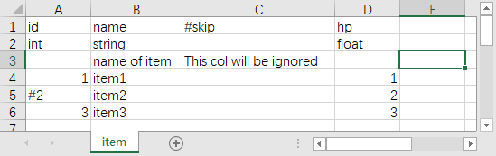

**生成的代码和数据：**

```c#
[Serializable]
public class SummaryExampleEntity
{
    public int id; // 只导入A、B列，C列被忽略
    /// <summary>
    /// name of item
    /// </summary>
    public string name;
}


[ExcelAsset]
public class SummaryExample : ScriptableObject
{
    public List<SummaryExampleEntity> item;
}
```

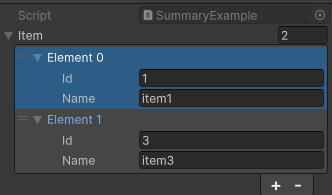

#### 表注释

在工作表名字前输入 `#`，整个工作表将被忽略。

### 数据边界

- **列边界**：第一行出现空单元格时，右侧所有列将被忽略
- **行边界**：第一列出现空单元格时，下方所有行将被忽略

### 枚举类型

先创建一个 C# 枚举：

```c#
// 创建 ColorEnum.cs 文件
public enum ColorEnum
{
    RED,    // 红色
    GREEN,  // 绿色  
    BLUE    // 蓝色
}
```

在 Excel 中直接填写枚举值，工具会自动匹配枚举类型：

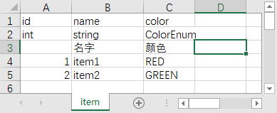

生成的代码和数据：

```c#
[Serializable]
public class EnumExampleEntity
{
    public int id;
    /// <summary>
    /// 名字
    /// </summary>
    public string name;
    /// <summary>
    /// 颜色
    /// </summary>
    public ColorEnum color; // 自动匹配枚举类型
}
```

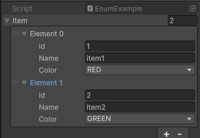

### 复杂类型

**支持数组类型、日期时间类型、字典类型和自定义类型**

使用数组类型的时候，可省略方括号。

创建自定义类型`CustomType`

```c#
[Serializable]
public class CustomType
{
    public int x;
    public string s;
}
```

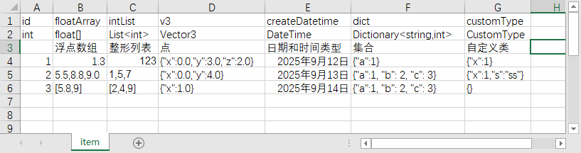

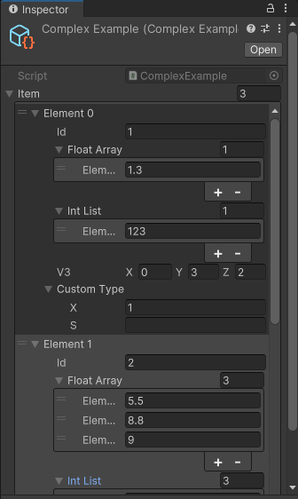

### 自定义资源路径

通过 `AssetPath` 参数控制生成的 `.asset` 文件位置：

```c#
[ExcelAsset(AssetPath = "Assets/Resources/MasterData")]
public class MstItems : ScriptableObject
{
    public List<MstItemsEntity> Entities;
}
```

### 调试日志

开启导入日志：

```c#
[ExcelAsset(LogOnImport = true)]  // 导入时输出详细日志
public class MstItems : ScriptableObject
{
    public List<MstItemsEntity> Entities;
}
```

### 自定义文件关联

当Excel文件名与ScriptableObject类名不一致时使用：

```c#
// Excel文件名为 "ItemData.xlsx"
// ScriptableObject类名为 "MstItems"

[ExcelAsset(ExcelName = "ItemData")]  // 指定关联的Excel文件名
public class MstItems : ScriptableObject
{
    public List<MstItemsEntity> Entities;
}
```

### 修改代码生成模板

代码生成模板位于 [`Assets/UnityExcelImporterX/Editor/Templates/ExcelAssetScriptTemplete.cs.txt`](Assets/UnityExcelImporterX/Editor/Templates/ExcelAssetScriptTemplete.cs.txt)。

可以根据项目规范自定义生成代码的风格。

## 常见问题

<details>
<summary>Q: Excel修改后没有自动更新？</summary>
**解决方法**：

1. 确保Excel文件已保存
2. 在Unity中右键点击Excel文件 → **Reimport**
3. 检查控制台是否有错误信息

</details>

<details>
<summary>Q: 修改表头后字段不匹配？</summary>

增删列、修改字段名或类型后，需要重新执行 **Create → ExcelAssetScript**，等待 Unity 编译完成后再导入。

</details>

<details>
<summary>Q: 找不到生成的 .asset？</summary>

默认资源与 Excel 位于同一目录；如果设置了 `AssetPath`，请到指定目录查找。

</details>

## 许可证

本库采用 [MIT许可证](LICENSE.txt)。

---

**如果本工具对您有帮助，请给个⭐Star支持一下！**
