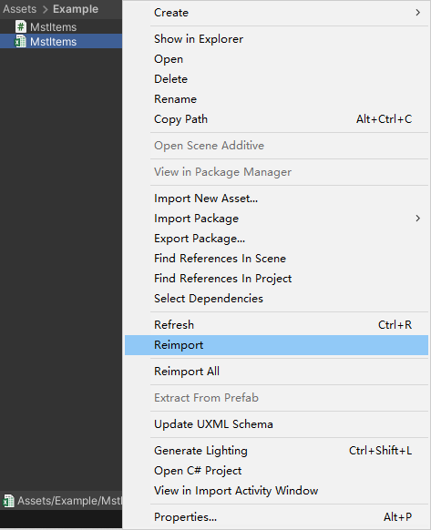
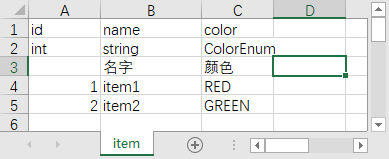

# UnityExcelImporterX - Unity Excel Data Import Tool

[中文文档](README.cn.md)

[](https://openupm.com/packages/net.nayaku.unity-excel-importer-x/) [](https://openupm.com/packages/net.nayaku.unity-excel-importer-x/)

<hr/>

Automatically converts Excel files (.xls, .xlsx) into Unity ScriptableObject assets.

This Project is based on [unity-excel-importer](https://github.com/mikito/unity-excel-importer.git) and includes some fatures that not available in the original project.

## ✨ Core Features

- 🤖 **Zero-code Generation**: No need to manually write entity class scripts, automatically generate complete code
- 🔄 **Real-time Sync**: Excel modifications automatically update Unity assets
- 📝 **Smart Comments**: Support for comment rows/columns and data boundaries
- 🎯 **Rich Types**: Support basic types, enums, arrays, dictionaries, datetime and custom types
- 📊 **Multi-sheet Support**: Import all worksheets in an Excel file at once

## 📦 Installation

<details>
<summary>💡 Install via .unitypackage file (Recommended)</summary>

1. Visit [GitHub Releases page](https://github.com/nayaku/UnityExcelImporterX/releases)
2. Download the latest `.unitypackage` file
3. Double-click the file or import via **Assets → Import Package → Custom Package** in Unity

</details>

<details>
<summary>💡 Install via OpenUPM</summary>

This package is available on the `<a href="https://openupm.com/packages/net.nayaku.unity-excel-importer-x/">`OpenUPM`</a>` repository.
Please ensure your project has the `NPOI` and `Newtonsoft.Json` dependencies installed before installing.

```
openupm add net.nayaku.unity-excel-importer-x
```

</details>

## 🚀 Quick Start

### Step 1: Create Excel File

Create an Excel file with the following structure:

| Row              | Content                    | Example                          |
| ---------------- | -------------------------- | -------------------------------- |
| **Row 1**  | Column names (field names) | `id`, `name`, `price`      |
| **Row 2**  | C# data types              | `int`, `string`, `float`   |
| **Row 3**  | Comments/Descriptions      | `ID`, `Item Name`, `Price` |
| **Row 4+** | Actual data                | `1`, `item1`, `99.5`       |

📋 **Example Table Structure:**


🎯 **Place the Excel file anywhere in your Unity project**

### Step 2: Auto-generate Code

1. **Select the Excel file in Unity**
2. **Right-click → Create → ExcelAssetScript** (or use **Assets → Create → ExcelAssetScript** from top menu)
3. **System will automatically generate entity class scripts** (e.g., `MstItems.cs`)


📊 **Generated Code Example:**

```csharp
// Entity class - corresponds to each row of the table
[Serializable]
public class MstItemsEntity
{
    /// <summary>
    /// ID
    /// </summary>
    public int id;           // Auto-matches Excel column 1
    /// <summary>
    /// Item Name
    /// </summary>
    public string name;      // Auto-matches Excel column 2
    /// <summary>
    /// Price
    /// </summary>
    public float price;      // Auto-matches Excel column 3
}

// Container class - stores all table data
[ExcelAsset]
public class MstItems : ScriptableObject
{
    public List<MstItemsEntity> Entities;  // All row data
}
```

⚠️ **Important**: When the Excel table structure changes (e.g., adding/removing columns), repeat this step to generate the latest code.

### Step 3: Auto-import Data

💡 **Simple operations only**:

- **Save the Excel file** (Ctrl+S)
- **Return to Unity**, the system will automatically detect changes and import data
- **A `.asset` file with the same name as the Excel file will be generated in the same directory**

**If not automatically generated, you can manually reimport the Excel file to trigger auto-generation:**


✅ **Done!** Now you can view and edit imported data directly in Unity:


## 🎯 Advanced Features

### Comment System

#### Single Row Comment

Enter `#` in the first cell of a row to skip the entire row.

#### Single Column Comment

Enter `#` in the first cell of a column to skip the entire column.

**Excel Table:**


**Generated Code and Data:**

```csharp
[Serializable]
public class SummaryExampleEntity
{
    public int id;      // Only imports columns A, B, column C is ignored
    /// <summary>
    /// name of item
    /// </summary>
    public string name;
}

[ExcelAsset]
public class SummaryExample : ScriptableObject
{
    public List<SummaryExampleEntity> item;
}
```


### Data Boundaries

- **Column Boundary**: When an empty cell appears in row 1, all columns to the right will be ignored
- **Row Boundary**: When an empty cell appears in column 1, all rows below will be ignored

### Enum

#### Step 1: Create a Enum Definition

```csharp
// Create ColorEnum.cs file
public enum ColorEnum
{
    RED,
    GREEN,
    BLUE
}
```

#### Step 2: Fill Enum Values in Excel



#### Step 3: Generated Code and Data

```csharp
[Serializable]
public class EnumExampleEntity
{
    public int id;
    /// <summary>
    /// Name
    /// </summary>
    public string name;
    /// <summary>
    /// Color
    /// </summary>
    public ColorEnum color; // Auto-matches enum type
}
```


### Complex Types

**Supports array types, datetime types, dictionary types and custom types**

When using array types, square brackets can be omitted.

**Generated Code and Data:**

Create custom type `CustomType`

```csharp
[Serializable]
public class CustomType
{
    public int x;
    public string s;
}
```


### Custom Asset Path

You can change the ScriptableObject generation position by specifying AssetPath as the ExcelAssetAttribute as shown below:

```csharp
[ExcelAsset(AssetPath = "Assets/Resources/MasterData")]
public class MstItems : ScriptableObject
{
    public List<MstItemsEntity> Entities;
}
```

### Debug Logging

When true is specified for LogOnImport of ExcelAssetAttribute, a log is output when the import process runs.

```csharp
[ExcelAsset(LogOnImport = true)]  // Output detailed logs during import
public class MstItems : ScriptableObject
{
    public List<MstItemsEntity> Entities;
}
```

### Custom File Association

You can change the association to a specific Excel file by specifying ExcelName of ExcelAssetAttribute:

```csharp
// Excel file name is "ItemData.xlsx"
// ScriptableObject class name is "MstItems"

[ExcelAsset(ExcelName = "ItemData")]  // Specify associated Excel file name
public class MstItems : ScriptableObject
{
    public List<MstItemsEntity> Entities;
}
```

## 🔧 FAQ

<details>
<summary>Q: Excel changes not auto-updating?</summary>

**Solutions**:

1. Ensure Excel file is saved
2. Right-click Excel file in Unity → Reimport
3. Check console for error messages

</details>

## 📄 License

This library is under the [MIT License](LICENSE.txt).

---

**If this tool helps you, please give it a ⭐Star!**
